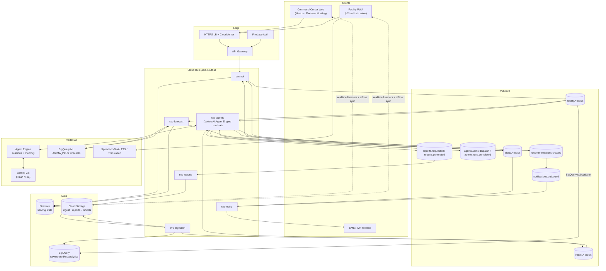
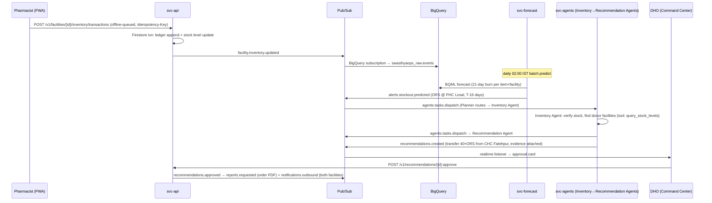

# 03 — System Architecture

**Status:** Approved · **Owner:** Architecture · **Last updated:** 2026-07-06
**Related:** [TRD](02_TRD.md) · [Database Schema](04_Database_Schema.md) · [AI Architecture](06_AI_Architecture.md) · [Agent Design](07_Agent_Design.md) · [Data Pipeline](14_Data_Pipeline.md) · Machine-readable registries: [architecture/](../architecture/)

---

## 1. Architectural style

**Event-driven, stateless, serverless.** Every fact about the district is an event on Pub/Sub; every service is a stateless Cloud Run container; every piece of intelligence is an agent on Vertex AI Agent Engine invoked through the same event fabric. There are exactly two synchronous paths in the system: user-facing REST reads (`svc-api`) and interactive agent chat. Everything else — ingestion, forecasting, alerting, recommendation, notification, reporting — is asynchronous.

Three invariants (enforced in code review, checked in [Testing Strategy](12_Testing_Strategy.md) §4 contract tests):
1. **Services never call each other over HTTP.** Cross-service communication is Pub/Sub only.
2. **Writes emit events.** Any state mutation in Firestore publishes the corresponding `facility.*` / domain event in the same logical operation (publish-then-write with idempotent reconciliation, see §6).
3. **Agents act through tools.** No agent has raw database credentials; tools call `svc-api`-equivalent internal functions with the agent's scoped identity.

## 2. System overview

Rendered service/topic registries: [architecture/service_catalog.md](../architecture/service_catalog.md), [architecture/pubsub_topics.yaml](../architecture/pubsub_topics.yaml), [architecture/event_catalog.md](../architecture/event_catalog.md).

## 3. Component responsibilities

| Component | Owns | Never does |
|---|---|---|
| `svc-api` | REST surface, authn/z enforcement, Firestore serving writes, domain event publication | Long-running work; calling Gemini for anything but the interactive NL-query path |
| `svc-ingestion` | Pulling/receiving public datasets, GCS landing, BigQuery raw loads, normalization to curated, `ingest.*` completion events | Serving reads; writing Firestore |
| `svc-agents` | Agent task envelope handling, Agent Engine session lifecycle, tool execution, `agent_runs` audit, publishing agent outputs | Direct DB access outside tool implementations; synchronous user traffic (except chat endpoint proxied by `svc-api`) |
| `svc-forecast` | BQML train/predict orchestration, materializing `forecasts` into Firestore, threshold breach detection → `alerts.stockout.predicted` | Any Gemini calls (deterministic path by design) |
| `svc-notify` | Channel fan-out (FCM/SMS/email), quiet hours, delivery receipts | Composing content (content arrives composed by Notification Agent) |
| `svc-reports` | HTML→PDF rendering, TTS audio assembly, GCS archival, signed URLs | Deciding what goes in a report (Report/Briefing Agents decide) |

## 4. Key event flows

### 4.1 Stock issue → stock-out prevention (the core loop)

### 4.2 Outbreak early warning
`facility.footfall.recorded` (symptom mix) + `ingest.idsp.loaded` + `ingest.weather.loaded` → Disease Intelligence Agent (scheduled daily + spike-triggered) correlates in BigQuery via tools → `alerts.outbreak.suspected` with confidence + GeoJSON of affected catchments → Planner fans out to Bed Agent (surge capacity check), Laboratory Agent (test readiness), Inventory Agent (ORS/zinc/antibiotic positioning) → composite recommendation to DHO.

### 4.3 Daily executive briefing
Cloud Scheduler 06:15 IST → `agents.tasks.dispatch{type: daily_briefing}` → Executive Briefing Agent pulls overnight deltas (tools: `get_district_summary`, `list_open_alerts`, `list_pending_recommendations`) → composes EN briefing → Translation API → HI → `reports.requested{format:[html,pdf,tts]}` → `svc-reports` renders + synthesizes audio → `briefings/{id}` written → `notifications.outbound` → DM/DHO devices by 07:00.

## 5. Deployment topology

- **One GCP project per environment** (`swasthyaops-dev|staging|prod`), one region `asia-south1`. Multi-district scale is **logical** (every document/event/table row carries `district_id`), not per-district projects — see [ADR-0003](../architecture/adr/0003-logical-multitenancy.md).
- Firebase Hosting serves `app.{env}.swasthyaops.in` (web + PWA from one Next.js build, [frontend/](../frontend/)).
- API Gateway fronts only `svc-api`; all other services are internal-ingress, invoked exclusively by Pub/Sub push with OIDC.
- DR: Firestore PITR + daily BigQuery snapshot copies to `asia-south2`; recovery runbook in [Deployment Guide](10_Deployment_Guide.md) §9.

## 6. Consistency model

- **Firestore is the source of truth for current state**; BigQuery is derived, eventually consistent (≤ 1 h ELT lag, ≤ 15 s for the streaming raw feed).
- Write path: Firestore transaction commits first, then event publish; a Firestore-triggered Eventarc reconciler republishes any document with `_published=false` older than 60 s, guaranteeing at-least-once event emission. Consumers dedup on `event_id` ([TRD](02_TRD.md) §3).
- Offline clients: Firestore SDK persistence gives causal consistency per client; cross-client conflicts resolved per [App Flow](08_App_Flow.md) §7.3.

## 7. Failure domains & degradation ladder

| Failure | Blast radius | Degraded behavior |
|---|---|---|
| Gemini/Vertex AI outage | All agents | Threshold-based alerts continue (svc-forecast is deterministic); briefing falls back to template; NL query disabled with notice — [AI Architecture](06_AI_Architecture.md) §5 |
| Pub/Sub unavailable (regional) | Async pipeline | API stays up (reads + writes land in Firestore, `_published=false`); reconciler drains on recovery |
| Firestore outage | Everything interactive | PWA continues offline; web shows cached snapshot + banner; SMS alert path from Cloud Monitoring |
| BigQuery outage | Forecasts, reports | Serving unaffected; jobs retry per Scheduler |
| Single service bad deploy | That service | Canary auto-rollback ([TRD](02_TRD.md) §13); Pub/Sub buffers 7 days |

## 8. Why not alternatives (summary — full text in ADRs)

- **Kafka vs Pub/Sub** — [ADR-0001](../architecture/adr/0001-pubsub-over-kafka.md): a district health department cannot staff Kafka ops; Pub/Sub gives ordering keys, DLQs, push-to-Cloud-Run, and per-message pricing that costs ~₹40/month at pilot volume vs a 3-broker cluster's fixed cost.
- **Cloud SQL vs Firestore** — [ADR-0002](../architecture/adr/0002-firestore-over-cloudsql.md): the offline-first PWA requirement (NFR-4) makes Firestore's sync engine decisive; relational analytics needs are served by BigQuery, not the OLTP store.
- **Per-district projects vs logical tenancy** — [ADR-0003](../architecture/adr/0003-logical-multitenancy.md).
- **Direct Gemini calls vs Agent Engine** — [ADR-0004](../architecture/adr/0004-agent-engine.md): managed sessions, memory bank, and tool-loop tracing outweigh the thin-wrapper simplicity of raw `generateContent`.
