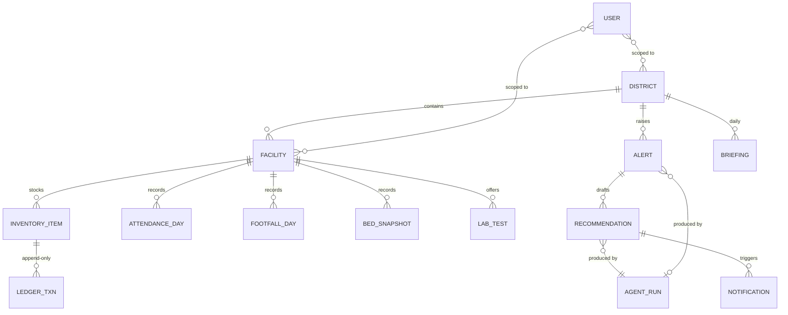

# 04 — Database Schema

**Status:** Approved · **Owner:** Engineering · **Last updated:** 2026-07-06
**Related:** [TRD](02_TRD.md) §4–5 · [System Architecture](03_System_Architecture.md) §6 · [API Spec](05_API_Specification.md) · [Data Pipeline](14_Data_Pipeline.md) · [Security](13_Security.md)
**Provisioned by:** [infra/terraform/firestore.tf](../infra/terraform/firestore.tf), [infra/terraform/bigquery.tf](../infra/terraform/bigquery.tf) · Pydantic models: [backend/app/models/schemas.py](../backend/app/models/schemas.py)

Two stores, one rule: **Firestore holds current operational state and serves clients (including offline); BigQuery holds history and serves analytics/ML.** Every Firestore write is mirrored to BigQuery via the Pub/Sub event stream ([Architecture](03_System_Architecture.md) §6).

---

## 1. Firestore collections

All documents carry the audit envelope: `created_at`, `updated_at` (server timestamps), `created_by` (`user:{uid}` | `agent:{name}` | `system:{job}`), `district_id` (tenancy key, [ADR-0003](../architecture/adr/0003-logical-multitenancy.md)), and `_published: bool` (event-emission reconciliation flag, [Architecture](03_System_Architecture.md) §6).

### 1.1 `districts/{districtId}`
```
name: string                     // "Sikar"
state: string                    // "Rajasthan"
lgd_code: string                 // LGD district code, joins public datasets (14_Data_Pipeline §2)
population: int                  // projected, updated yearly from ingestion
geo: { center: geopoint, boundary_gcs_uri: string }   // GeoJSON in Cloud Storage
health_score: number             // 0-100 composite, recomputed hourly
counters: { facilities: int, open_alerts: int, pending_recommendations: int }
```

### 1.2 `facilities/{facilityId}`
```
district_id, name, type: "PHC"|"CHC"|"DH"|"SC"
nin: string                      // National Identification Number from Health Centre Directory
location: geopoint
address, block: string
sanctioned: { doctors: int, nurses: int, pharmacists: int, lab_techs: int, beds: int }
services: string[]               // ["opd","ipd","lab","xray","delivery"]
catchment_population: int
status: "active"|"stale"|"inactive"    // stale = no events 48h (PRD §9)
health_score: number
snapshot: {                      // denormalized for map/list rendering — updated by svc-api on writes
  stockout_items: int, stock_risk_items: int,
  doctors_present_today: int, beds_available: int,
  labs_functional: int, labs_total: int,
  footfall_today: int, last_event_at: timestamp
}
```

**Subcollections:**

| Path | Document | Notes |
|---|---|---|
| `inventory/{itemId}` | `item_code` (EDL code), `name`, `unit`, `current_stock: int`, `reorder_level: int`, `avg_daily_consumption: number`, `predicted_stockout_date: timestamp?`, `forecast_confidence: number?`, `batches: [{batch_no, expiry_date, qty}]` | Current levels only; movements in ledger |
| `inventory/{itemId}/ledger/{txnId}` | `type: "receipt"|"issue"|"adjustment"|"expiry"|"transfer_in"|"transfer_out"`, `qty: int` (signed), `balance_after: int`, `batch_no?`, `source: "form"|"voice"|"barcode"|"import"`, `recorded_at` (client), `idempotency_key` | Append-only. **TTL 180 d** (history lives in BigQuery) |
| `attendance/{yyyy-mm-dd}` | `entries: [{staff_id, name, role, status: "present"|"absent"|"on_duty_elsewhere"|"leave", leave_type?, marked_by, marked_at}]` | One doc/day — bounded by staff count (< 50) |
| `beds/{yyyy-mm-dd}` | `total`, `occupied`, `maintenance`, `by_ward: map`, `updated_at` | Latest doc = current; **TTL 90 d** |
| `labs/{testCode}` | `name`, `status: "functional"|"non_functional"|"reagent_out"`, `since: timestamp`, `reason?` | Sanctioned test list per facility type |
| `footfall/{yyyy-mm-dd}` | `total: int`, `by_symptom: {fever, diarrheal, respiratory, injury, anc, other}`, `by_gender`, `source`, `entries: [{recorded_at, delta, by_symptom}]` | Intraday increments appended; **TTL 90 d** |
| `staff/{staffId}` | `name`, `role`, `phone`, `hpr_id?`, `active: bool` | Roster, not credentials — users auth via `users` |

### 1.3 `alerts/{alertId}`
```
district_id, facility_ids: string[]
type: "stockout_predicted"|"stock_critical"|"attendance_anomaly"|"footfall_spike"|
      "outbreak_suspected"|"bed_saturation"|"lab_downtime"|"reporting_gap"
severity: "critical"|"high"|"medium"|"low"
status: "open"|"acknowledged"|"in_progress"|"resolved"|"dismissed"
title, summary: string           // human-readable, EN (HI via Translation on read)
evidence: [{ kind: "metric"|"forecast"|"event"|"dataset", ref: string, value: any }]
source: string                   // "agent:disease_intelligence" | "system:svc-forecast"
agent_run_id?: string            // provenance → agent_runs
recommendation_ids: string[]
status_history: [{status, by, at, note?}]
expires_at?: timestamp           // TTL field — auto-cleanup of resolved alerts after 90 d
```

### 1.4 `recommendations/{recId}`
```
district_id, alert_id?, type: "stock_transfer"|"emergency_indent"|"staffing_directive"|
                              "outbreak_response"|"maintenance_request"
status: "draft"|"pending_approval"|"approved"|"rejected"|"executed"|"expired"
title, rationale: string
actions: [                       // typed per recommendation type, validated by Pydantic
  { kind: "transfer", item_code, qty, from_facility_id, to_facility_id, by_date } |
  { kind: "indent", item_code, qty, supplier: "RMSC", priority } |
  { kind: "directive", facility_id, staff_role, instruction, duration_days } ...
]
validity_snapshot: { taken_at, stock_checks: [{facility_id, item_code, qty_available}] }  // PRD §9 re-validation
approval: { by?, at?, edits?: json_patch[], rejection_reason? }
order_pdf_uri?: string           // gs://swasthyaops-{env}-reports/orders/...
agent_run_id: string
expires_at: timestamp            // TTL — drafts auto-expire 7 d
```

### 1.5 Other root collections

| Collection | Purpose | Key fields | TTL |
|---|---|---|---|
| `users/{uid}` | Profile + authz mirror of custom claims | `role`, `district_ids[]`, `facility_ids[]`, `locale: "en"|"hi"`, `channels: {push, sms, email}`, `quiet_hours` | — |
| `agent_runs/{runId}` | Full audit of every agent execution ([AI Architecture](06_AI_Architecture.md) §9) | `agent`, `task_type`, `trigger_event_id`, `prompt_version`, `model`, `tool_calls: [{tool, args, result_digest, ms}]`, `tokens: {in, out, cached}`, `cost_usd`, `outcome`, `latency_ms`, `error?` | `expires_at` 30 d (mirrored to BigQuery permanently) |
| `notifications/{notifId}` | Outbound message + delivery state | `user_id`, `channel`, `severity`, `title`, `body`, `status: queued|sent|delivered|failed`, `attempts` | 30 d |
| `briefings/{districtId}_{yyyy-mm-dd}` | Daily executive briefing | `sections: [{heading, body_en, body_hi, refs[]}]`, `audio_uri_en`, `audio_uri_hi`, `pdf_uri`, `generated_at`, `opened_by: map` | 90 d |
| `reports/{reportId}` | Monthly/ad-hoc reports | `type`, `period`, `status`, `pdf_uri`, `requested_by` | — |
| `forecasts/{facilityId}_{itemCode}` | Materialized latest forecast for serving | `horizon: [{date, qty_lower, qty_mean, qty_upper}]`, `stockout_date?`, `model_version`, `generated_at` | 14 d |
| `config/medicine_catalog` | Versioned EDL (381 items) | `version`, `items: map<code, {name, unit, category, is_essential}>` | — |
| `config/thresholds` | Alert thresholds per facility type | `stock_days_critical: 7`, `footfall_spike_z: 2.5`, ... | — |
| `audit_logs/{logId}` | Immutable human+agent action trail | `actor`, `action`, `resource`, `before_digest`, `after_digest`, `ip?` | — (also sinked to BigQuery) |

### 1.6 Composite indexes (declared in Terraform)

| Collection (group) | Fields | Serves |
|---|---|---|
| `alerts` | `district_id ASC, status ASC, severity ASC, created_at DESC` | Alert inbox default view |
| `alerts` | `district_id ASC, type ASC, created_at DESC` | Filter by alert class |
| `recommendations` | `district_id ASC, status ASC, created_at DESC` | Approval queue |
| `facilities` | `district_id ASC, type ASC, health_score ASC` | Worst-first facility list |
| `inventory` (collection group) | `item_code ASC, current_stock ASC` | Donor-facility search for transfers |
| `inventory` (collection group) | `district_id ASC, predicted_stockout_date ASC` | District stock-risk list |
| `notifications` | `user_id ASC, status ASC, created_at DESC` | User notification feed |
| `agent_runs` | `agent ASC, outcome ASC, created_at DESC` | Agent ops dashboard |

### 1.7 TTL policies
Firestore TTL on `expires_at` for: `alerts`, `recommendations`, `agent_runs`, `notifications`, `briefings`, `forecasts`, and ledger/beds/footfall subcollections as noted above. History is never lost — BigQuery retains everything ([§3](#3-bigquery)).

### 1.8 Security rules (excerpt — full file [infra/firestore.rules](../infra/firestore.rules))

```
rules_version = '2';
service cloud.firestore {
  match /databases/{database}/documents {
    function claims() { return request.auth.token; }
    function inDistrict(d) { return request.auth != null && d in claims().district_ids; }
    function hasFacility(f) { return f in claims().facility_ids; }
    function role() { return claims().role; }

    match /districts/{d} { allow read: if inDistrict(d); allow write: if false; }

    match /facilities/{f} {
      allow read: if inDistrict(resource.data.district_id);
      allow write: if false;                       // all writes via svc-api
      match /{sub=**} {
        allow read: if inDistrict(get(/databases/$(database)/documents/facilities/$(f)).data.district_id);
        allow write: if false;
      }
    }

    match /alerts/{a} {
      allow read: if inDistrict(resource.data.district_id);
      allow write: if false;
    }
    match /recommendations/{r} {
      allow read: if inDistrict(resource.data.district_id)
                  && role() in ['district_admin','dm','state_admin','viewer'];
      allow write: if false;
    }
    match /users/{uid} { allow read: if request.auth.uid == uid; allow write: if false; }
    match /briefings/{b} { allow read: if inDistrict(resource.data.district_id); allow write: if false; }
    match /{other=**} { allow read, write: if false; }
  }
}
```

Design point: **clients never write Firestore directly** — even offline. The PWA queues mutations in its outbox and replays through `/v1` on reconnect ([App Flow](08_App_Flow.md) §7); Firestore persistence is used for offline *reads* and realtime listeners. This keeps validation, event emission, and idempotency in one place.

## 2. Entity relationships



## 3. BigQuery

Datasets (all `asia-south1`, provisioned in [infra/terraform/bigquery.tf](../infra/terraform/bigquery.tf)):

### 3.1 `swasthyaops_raw` — landing, source-shaped
| Table | Source | Partition |
|---|---|---|
| `events` | Pub/Sub BigQuery subscription (all domain topics; envelope + JSON payload) | `_ingest_ts` (day) |
| `hmis_monthly` | svc-ingestion (HMIS portal exports) | `report_month` |
| `nfhs_indicators` | NFHS-5 district factsheets (one-time + updates) | — (small) |
| `rhs_infrastructure` | Rural Health Statistics annual | `report_year` |
| `idsp_weekly` | IDSP weekly outbreak reports | `report_week` |
| `weather_daily` | Open-Meteo/IMD daily pulls | `date` |
| `population_projections` | Census + projections | — |
| `facility_directory` | Health Centre Directory (NIN registry) | — |

### 3.2 `swasthyaops_curated` — typed, deduped; all partitioned on date, clustered `(district_id, facility_id)`, `require_partition_filter=true`

```sql
CREATE TABLE swasthyaops_curated.inventory_transactions (
  event_id STRING NOT NULL,            -- dedup key
  occurred_at TIMESTAMP NOT NULL,
  district_id STRING NOT NULL, facility_id STRING NOT NULL,
  item_code STRING NOT NULL, item_name STRING,
  txn_type STRING NOT NULL,            -- receipt|issue|adjustment|expiry|transfer_in|transfer_out
  qty INT64 NOT NULL, balance_after INT64,
  batch_no STRING, source STRING, actor STRING
) PARTITION BY DATE(occurred_at) CLUSTER BY district_id, facility_id;
```

Same pattern for: `footfall_daily` (symptom columns), `attendance_daily` (one row/staff/day), `bed_snapshots`, `lab_status_changes`, `alerts`, `recommendations`, `agent_runs` (permanent audit mirror), `audit_logs`, `processed_events` (consumer dedup, 30 d expiry).

Hourly ELT: scheduled queries `raw.events` → curated with `MERGE` on `event_id` (idempotent). SQL lives in [scripts/sql/](../scripts/sql/) and is deployed by Terraform `google_bigquery_data_transfer_config`.

### 3.3 `swasthyaops_ml`
| Object | Definition |
|---|---|
| `consumption_features` | View: daily consumption per `facility×item` from `inventory_transactions` (issues only), gap-filled, with weather + footfall covariates |
| `m_consumption_arima` | `ARIMA_PLUS` model, `TIME_SERIES_ID_COL = ts_id` (`facility_id||'#'||item_code`), horizon 21, retrained weekly Sun 01:00 IST by `svc-forecast` |
| `m_footfall_arima` | `ARIMA_PLUS_XREG` per facility with weather/day-of-week regressors |
| `predictions_consumption` | Batch `ML.FORECAST` output, partitioned by `forecast_date` |
| `anomaly_footfall` | `ML.DETECT_ANOMALIES` output feeding Disease Intelligence Agent |

### 3.4 `swasthyaops_analytics` — serving views for reports & KPI tiles
`v_stockout_days_monthly`, `v_attendance_rate`, `v_alert_response_latency`, `v_district_kpis` (the PRD §4 KPI table, one row/district/day), `mv_command_center_tiles` (materialized, 1 h refresh). Read by `svc-reports` and the KPI API.

### 3.5 Access
Per-dataset IAM (TRD §7): raw — ingestion only; curated — agents read, ELT writes; ml — forecast service; analytics — reports + API. No user-facing service queries raw.
