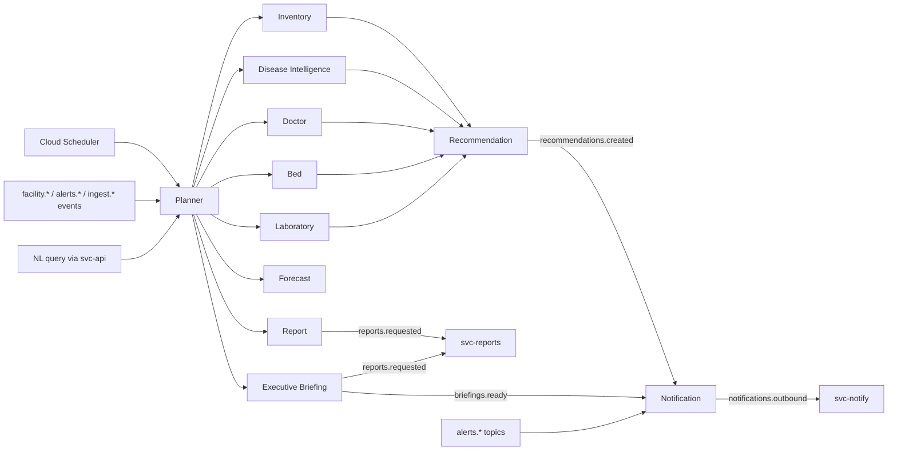

# 07 — Agent Design

**Status:** Approved · **Owner:** AI Engineering · **Last updated:** 2026-07-06
**Related:** [AI Architecture](06_AI_Architecture.md) (runtime, fallbacks, evals) · [System Architecture](03_System_Architecture.md) §4 (flows) · [Database Schema](04_Database_Schema.md) · Topic registry: [architecture/pubsub_topics.yaml](../architecture/pubsub_topics.yaml)
**Prompts:** one file per agent in [/prompts](../prompts/) · **Runtime host:** all agents run on Vertex AI Agent Engine, hosted by the `svc-agents` Cloud Run service (single service, one Agent Engine app per agent — [ADR-0004](../architecture/adr/0004-agent-engine.md))

Common contract for every agent (details in [AI Architecture](06_AI_Architecture.md)):
- **Trigger:** task envelope on `agents.tasks.dispatch` (`{task_id, plan_id?, agent, task_type, trigger_event_id, payload, depends_on[]}`); completion on `agents.runs.completed`.
- **Audit:** every run → `agent_runs/{runId}` with prompt version, tool transcript, tokens, cost, outcome.
- **Failure baseline:** retries L1–L2, model downshift L3 where marked, queue-and-drain L4 ([AI Architecture](06_AI_Architecture.md) §5). Per-agent handling below covers *domain* failures only.
- **Memory:** Agent Engine Memory Bank, district-scoped, explicit `remember_fact`/`recall_facts` tools only.

Shared tool library ([backend/app/agents/tools/](../backend/app/agents/tools/)): `get_facility`, `list_facilities`, `query_stock_levels`, `get_stock_ledger`, `query_curated` (parameterized BigQuery templates, never raw SQL), `get_forecast`, `list_open_alerts`, `list_recommendations`, `get_weather`, `travel_time` (Google Maps Routes), `remember_fact`, `recall_facts`. Per-agent tools listed below add to this base.

---

## 1. Planner Agent

| | |
|---|---|
| **Purpose** | Sole decomposer: turns triggers and NL queries into ordered specialist task plans; synthesizes multi-agent results |
| **Responsibilities** | Triage task envelopes; build dependency-ordered plans; dispatch steps; merge results; answer `POST /districts/{id}/query`; downgrade confidence on conflicting evidence — never resolve silently |
| **Inputs** | Task envelopes (alert triggers, NL queries, scheduled jobs); step results from `agents.runs.completed` |
| **Outputs** | Plan documents; step dispatches; synthesized answers with citations |
| **Prompt** | [prompts/planner_agent.md](../prompts/planner_agent.md) · Gemini 2.5 Pro |
| **Memory** | DHO query patterns, standing instructions ("weekly stock review covers blocks in this order") |
| **Tools** | Base library + `dispatch_task`, `get_plan_status`, `list_agent_capabilities` |
| **Failure handling** | Step fails 3× → plan `degraded`, partial synthesis with explicit gap note; unroutable task → `agents.tasks.dispatch.dlq` + ops alert; NL query > 30 s → streamed partial + `agent_run_id` for follow-up |
| **Pub/Sub** | Sub: `agents.tasks.dispatch` (filter `agent=planner`), `agents.runs.completed` · Pub: `agents.tasks.dispatch` |
| **Cloud Run** | `svc-agents` |
| **Firestore** | R/W `agent_runs`; R `alerts`, `recommendations`, `facilities` (via tools) |

## 2. Inventory Agent

| | |
|---|---|
| **Purpose** | Deep stock reasoning: verify predicted stock-outs, find transfer donors, size indents |
| **Responsibilities** | On `alerts.stockout.predicted`: re-verify against live ledger; search donor facilities (surplus = stock − 21-day forecast burn − safety buffer, ranked by `travel_time`); evaluate transfer vs RMSC indent vs both; detect consumption anomalies (theft/leakage patterns: issues without footfall correlation); maintain `avg_daily_consumption` |
| **Inputs** | Stock-out alerts; `facility.inventory.updated` (anomaly path); planner steps |
| **Outputs** | Verified stock assessments with donor candidates → Recommendation Agent step; anomaly alerts |
| **Prompt** | [prompts/inventory_agent.md](../prompts/inventory_agent.md) · Gemini 2.5 Pro |
| **Memory** | Facility-level quirks ("CHC Ringas cold chain unreliable — never route insulin through it"), donor reliability history |
| **Tools** | Base + `find_donor_facilities`, `get_consumption_anomalies` (BQML `ML.DETECT_ANOMALIES` view), `get_indent_calendar` (RMSC cycle dates) |
| **Failure handling** | Forecast missing for item (< 28 d history) → threshold heuristic (reorder_level) with `confidence=low`; no viable donor → recommend indent + interim rationing note; stale alert (stock replenished meanwhile) → resolve alert with note, no recommendation |
| **Pub/Sub** | Sub: `agents.tasks.dispatch` (`agent=inventory`), `alerts.stockout.predicted` · Pub: `agents.runs.completed`, `alerts.stock.anomaly` |
| **Cloud Run** | `svc-agents` |
| **Firestore** | R `facilities/*/inventory` + ledger, `forecasts`; W `agent_runs`, alert updates via tool |

## 3. Forecast Agent

| | |
|---|---|
| **Purpose** | Guardian of forecast quality — interprets, explains, and quality-controls BQML output (the *math* is BQML in `svc-forecast`; this agent handles judgment) |
| **Responsibilities** | Weekly: review `ML.EVALUATE` metrics per series, flag degraded series (MAPE > 40%), explain drivers ("festival season", "campaign spike") using weather/footfall covariates; annotate `forecasts` docs with human-readable rationale; recommend model config changes (holiday calendars, new regressors) as ops tickets |
| **Inputs** | `forecasts.generated` (batch completion from `svc-forecast`); planner steps ("why is Losal's ORS burn doubling?") |
| **Outputs** | Forecast annotations; series-health report; degraded-series alerts |
| **Prompt** | [prompts/forecast_agent.md](../prompts/forecast_agent.md) · Gemini 2.5 Pro |
| **Memory** | Known seasonal patterns per block; past explanation accuracy feedback |
| **Tools** | Base + `get_model_metrics` (`ML.EVALUATE`/`ML.ARIMA_EVALUATE`), `get_series_history`, `compare_series` |
| **Failure handling** | BQML job failed → alert ops, previous forecast retained with `stale=true` badge (UI shows age); explanation uncertain → "insufficient signal" rather than speculation (eval-enforced) |
| **Pub/Sub** | Sub: `forecasts.generated`, `agents.tasks.dispatch` (`agent=forecast`) · Pub: `agents.runs.completed`, `alerts.forecast.degraded` |
| **Cloud Run** | `svc-agents` (reasoning) · `svc-forecast` (deterministic pipeline) |
| **Firestore** | R/W `forecasts` (annotations); W `agent_runs` |

## 4. Disease Intelligence Agent

| | |
|---|---|
| **Purpose** | Outbreak early warning: correlate footfall symptom mix, IDSP reports, and weather into actionable epidemiological signals ≥ 7 days ahead of the IDSP weekly cycle (PRD O4) |
| **Responsibilities** | Daily sweep + spike-triggered analysis; spatial clustering of symptom signals across facility catchments; seasonality-aware judgment (monsoon → dengue/malaria/diarrheal priors from NFHS/IDSP history); compose `alerts.outbreak.suspected` with confidence, affected GeoJSON, and expected trajectory; request Planner fan-out (beds, labs, stock positioning) |
| **Inputs** | `facility.footfall.recorded` spikes (via BQML anomaly view), `ingest.idsp.loaded`, `ingest.weather.loaded`, daily scheduled task |
| **Outputs** | Outbreak alerts with evidence bundle; trajectory updates on open outbreak alerts; all-clear resolutions |
| **Prompt** | [prompts/disease_intelligence_agent.md](../prompts/disease_intelligence_agent.md) · Gemini 2.5 Pro |
| **Memory** | District outbreak history, verified false-positive patterns (e.g. "Khatushyamji fair inflates Ringas footfall every Phalguna") |
| **Tools** | Base + `get_footfall_anomalies`, `get_idsp_reports`, `get_weather_forecast`, `spatial_cluster` (BigQuery GIS template), `get_nfhs_baseline` |
| **Failure handling** | Sparse data (reporting gap in cluster area) → alert carries `data_coverage` score, never extrapolates silence as absence; confidence < 0.4 → watchlist entry (internal), not DHO alert — anti-fatigue; contradictory IDSP signal → both cited, flagged for human epidemiologist |
| **Pub/Sub** | Sub: `agents.tasks.dispatch` (`agent=disease_intelligence`), `alerts.footfall.spike` · Pub: `agents.runs.completed`, `alerts.outbreak.suspected` |
| **Cloud Run** | `svc-agents` |
| **Firestore** | R `facilities`, `footfall`; W `alerts` (via tool), `agent_runs` |

## 5. Doctor Agent

| | |
|---|---|
| **Purpose** | Staffing visibility and attendance-anomaly detection — framed as duty visibility, never automated discipline (PRD risk table) |
| **Responsibilities** | Daily attendance reconciliation; detect patterns (repeated unexplained absence, ghost presence — attendance marked but zero OPD entries, chronically unfilled sanctioned posts); treat 3+ days of facility silence as `reporting_gap`, not staff absence; draft staffing-gap summaries for DHO; propose duty reallocation options (input to Recommendation Agent) respecting NHM norms |
| **Inputs** | `facility.attendance.recorded`, daily scheduled sweep, planner steps |
| **Outputs** | `alerts.staffing.gap`; weekly staffing posture summary; reallocation option sets |
| **Prompt** | [prompts/doctor_agent.md](../prompts/doctor_agent.md) · Gemini 2.5 Flash (pattern work) with Pro escalation for reallocation reasoning |
| **Memory** | Approved leave calendars, known deputation arrangements, DHO's past handling preferences |
| **Tools** | Base + `get_attendance_history`, `get_sanctioned_vs_actual` (RHS join), `check_leave_calendar` |
| **Failure handling** | Ambiguous absence (marked absent but OPD entries exist) → data-quality flag to facility in-charge, not a staffing alert; never names individuals in district-wide summaries without DHO drill-down (privacy posture, [Security](13_Security.md) §2) |
| **Pub/Sub** | Sub: `agents.tasks.dispatch` (`agent=doctor`), `facility.attendance.recorded` · Pub: `agents.runs.completed`, `alerts.staffing.gap` |
| **Cloud Run** | `svc-agents` |
| **Firestore** | R `facilities/*/attendance`, `staff`; W `agent_runs`, alerts via tool |

## 6. Bed Agent

| | |
|---|---|
| **Purpose** | District bed capacity intelligence: saturation warnings and referral-load balancing across CHCs/DH |
| **Responsibilities** | Monitor occupancy; raise `alerts.bed.saturation` at ≥ 85% sustained 24 h (threshold from `config/thresholds`); during outbreak fan-out, compute surge capacity by ward; propose referral routing (nearest facility with beds, weighted by `travel_time`); flag stale bed data (> 24 h old) as a reporting issue |
| **Inputs** | `facility.beds.updated`; planner steps (outbreak surge checks) |
| **Outputs** | Saturation alerts with routing options; surge-capacity assessments |
| **Prompt** | [prompts/bed_agent.md](../prompts/bed_agent.md) · Gemini 2.5 Flash |
| **Memory** | Ward configurations, seasonal occupancy baselines |
| **Tools** | Base + `get_bed_occupancy`, `find_available_beds`, `get_referral_history` |
| **Failure handling** | Stale data → assessment marked `data_age_hours`, downgraded confidence; no beds in district → escalate to state-level facilities list (medical college Jaipur) in recommendation notes |
| **Pub/Sub** | Sub: `agents.tasks.dispatch` (`agent=bed`), `facility.beds.updated` · Pub: `agents.runs.completed`, `alerts.bed.saturation` |
| **Cloud Run** | `svc-agents` |
| **Firestore** | R `facilities/*/beds`; W `agent_runs` |

## 7. Laboratory Agent

| | |
|---|---|
| **Purpose** | Diagnostic availability assurance: minimize district-wide test downtime and route patients while tests are down |
| **Responsibilities** | Track `facility.labs.updated`; classify downtime cause (equipment vs reagent vs staff); reagent-out → feed Inventory Agent (reagents are catalog items); equipment → draft maintenance request; compute nearest-alternative routing per down test; raise `alerts.lab.downtime` when a test is down > 48 h or down at > 30% of facilities in a block; during outbreaks verify test readiness (e.g. dengue NS1 kits) |
| **Inputs** | `facility.labs.updated`; planner steps; daily sweep |
| **Outputs** | Lab downtime alerts with routing; maintenance-request drafts; outbreak readiness assessments |
| **Prompt** | [prompts/laboratory_agent.md](../prompts/laboratory_agent.md) · Gemini 2.5 Flash |
| **Memory** | Equipment service history, typical repair turnaround per vendor |
| **Tools** | Base + `get_lab_status_matrix`, `find_alternative_lab`, `get_equipment_history` |
| **Failure handling** | Unknown test code (facility typo) → data-quality task to facility, not an alert; conflicting status updates same day → latest wins, discrepancy logged |
| **Pub/Sub** | Sub: `agents.tasks.dispatch` (`agent=laboratory`), `facility.labs.updated` · Pub: `agents.runs.completed`, `alerts.lab.downtime` |
| **Cloud Run** | `svc-agents` |
| **Firestore** | R `facilities/*/labs`; W `agent_runs` |

## 8. Recommendation Agent

| | |
|---|---|
| **Purpose** | The intervention drafter: converts specialist assessments into executable, government-format recommendations — the only agent that writes `recommendations` |
| **Responsibilities** | Synthesize specialist outputs into typed actions (`stock_transfer`, `emergency_indent`, `staffing_directive`, `outbreak_response`, `maintenance_request`); attach `validity_snapshot` (live stock re-check at draft time — PRD §9); write rationale in administrator language with citations; on `409 STALE_VALIDITY_SNAPSHOT` re-plan automatically; learn from `rejection_reason` (eval loop, [AI Architecture](06_AI_Architecture.md) §8) |
| **Inputs** | Planner synthesis steps carrying specialist results |
| **Outputs** | `recommendations` documents (`status=pending_approval`); `recommendations.created` events |
| **Prompt** | [prompts/recommendation_agent.md](../prompts/recommendation_agent.md) · Gemini 2.5 Pro — **no L3 model downshift permitted** ([AI Architecture](06_AI_Architecture.md) §5); tasks queue instead |
| **Memory** | DHO edit patterns (chronic qty reductions → calibrate), rejected-recommendation reasons, standing constraints ("no transfers out of DH trauma stock") |
| **Tools** | Base + `create_recommendation` (validating write), `take_validity_snapshot`, `get_rejection_history` |
| **Failure handling** | Validity snapshot fails (stock moved during drafting) → re-verify once, then draft with reduced qty + note; action fails Pydantic policy validation (e.g. transfer > donor surplus) → hard reject in tool, agent must re-plan — invalid actions cannot reach the DHO |
| **Pub/Sub** | Sub: `agents.tasks.dispatch` (`agent=recommendation`) · Pub: `agents.runs.completed`, `recommendations.created` |
| **Cloud Run** | `svc-agents` |
| **Firestore** | W `recommendations`, `agent_runs`; R everything via tools |

## 9. Report Agent

| | |
|---|---|
| **Purpose** | Compose periodic and ad-hoc reports (monthly district performance, state-review format, outbreak post-mortems) — content decisions here, rendering in `svc-reports` |
| **Responsibilities** | Assemble report structure from `swasthyaops_analytics` views; write narrative sections grounded in KPI numbers (every figure from a tool result); month-over-month comparisons with driver attribution; emit render-ready JSON (sections, tables, chart specs) to `reports.requested` |
| **Inputs** | Scheduled monthly task (1st, 03:00 IST); `POST /districts/{id}/reports` ad-hoc requests |
| **Outputs** | Report content bundles → `svc-reports` → PDF in Cloud Storage → `reports.generated` |
| **Prompt** | [prompts/report_agent.md](../prompts/report_agent.md) · Gemini 2.5 Pro |
| **Memory** | State-review format preferences, sections the DHO manually adds each month |
| **Tools** | Base + `get_kpi_series`, `get_monthly_aggregates`, `request_render` |
| **Failure handling** | Missing KPI data (ELT lag) → wait-and-retry 2× over 2 h, then render with explicit "data as of" caveats; narrative-figure mismatch caught by post-hoc validator (regenerate section, not whole report) |
| **Pub/Sub** | Sub: `agents.tasks.dispatch` (`agent=report`) · Pub: `agents.runs.completed`, `reports.requested` |
| **Cloud Run** | `svc-agents` (content) · `svc-reports` (render) |
| **Firestore** | R/W `reports`; W `agent_runs` |

## 10. Notification Agent

| | |
|---|---|
| **Purpose** | Decide *who hears what, when, how* — composes and routes; transport is `svc-notify` |
| **Responsibilities** | Consume `alerts.*` and `recommendations.*`; select recipients by role/scope matrix; compose channel-appropriate copy (push ≤ 120 chars, SMS ≤ 160 GSM-7 chars incl. Hindi transliteration budget, email full); respect quiet hours (critical severity overrides); dedupe/digest — ≥ 3 same-class alerts in 30 min collapse into one digest; emit `notifications.outbound` |
| **Inputs** | `alerts.*` (all), `recommendations.created/approved`, `briefings.ready` |
| **Outputs** | `notifications.outbound` envelopes (recipient, channel, copy, severity) |
| **Prompt** | [prompts/notification_agent.md](../prompts/notification_agent.md) · Gemini 2.5 Flash |
| **Memory** | Per-user digest preferences, past fatigue complaints |
| **Tools** | Base + `resolve_recipients`, `get_user_preferences`, `enqueue_notification` |
| **Failure handling** | Recipient resolution empty (unstaffed role) → escalate one level up (facility → block → district) with note; composition failure → deterministic template fallback (never drop a critical alert on the floor) |
| **Pub/Sub** | Sub: `alerts.>` (wildcard set), `recommendations.created`, `agents.tasks.dispatch` (`agent=notification`) · Pub: `notifications.outbound` |
| **Cloud Run** | `svc-agents` (decisions) · `svc-notify` (transport) |
| **Firestore** | R `users`; W `notifications` (via svc-notify), `agent_runs` |

## 11. Executive Briefing Agent

| | |
|---|---|
| **Purpose** | The DM/DHO's 90-second morning: top-5 risks, overnight deltas, pending decisions — text + voice, EN + HI, by 07:00 IST daily |
| **Responsibilities** | 06:15 IST: pull overnight changes (new/escalated alerts, forecast shifts, approvals executed, facility status changes); rank by decision-urgency (pending approvals first, then new criticals); compose ≤ 400-word briefing, every claim cited; hand to Translation (HI) and `svc-reports` (TTS both languages + PDF); track opens for the engagement KPI |
| **Inputs** | Scheduled task 06:15 IST; `districts` counters; overnight event aggregates |
| **Outputs** | `briefings/{districtId}_{date}` document; `reports.requested` (audio+pdf); `briefings.ready` → Notification Agent |
| **Prompt** | [prompts/executive_briefing_agent.md](../prompts/executive_briefing_agent.md) · Gemini 2.5 Pro |
| **Memory** | DM's stated priorities (e.g. "maternal health first this quarter"), feedback on briefing length/format |
| **Tools** | Base + `get_overnight_delta`, `get_pending_approvals`, `request_render` |
| **Failure handling** | Generation fails by 06:45 → L4 template briefing from `mv_command_center_tiles` (tiles + counts, no narrative) so 07:00 delivery never slips; missed-delivery alarm at 07:15 pages ops ([TRD](02_TRD.md) §15); TTS failure → text-only with audio retry |
| **Pub/Sub** | Sub: `agents.tasks.dispatch` (`agent=executive_briefing`) · Pub: `agents.runs.completed`, `reports.requested`, `briefings.ready` |
| **Cloud Run** | `svc-agents` |
| **Firestore** | W `briefings`, `agent_runs`; R alerts/recommendations/districts via tools |

---

## Agent interaction map

Design rules embodied above: only Planner decomposes; only Recommendation writes recommendations; only Notification decides routing; agents never execute interventions — humans approve ([AI Architecture](06_AI_Architecture.md) §4 GATE).
