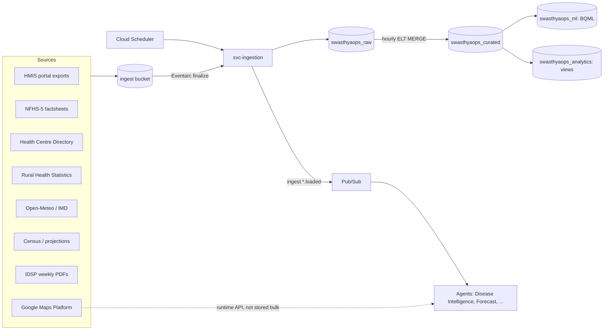

# 14 — Data Pipeline

**Status:** Approved · **Owner:** Data Engineering · **Last updated:** 2026-07-06
**Related:** [Database Schema](04_Database_Schema.md) §3 (target tables) · [TRD](02_TRD.md) §5 · [System Architecture](03_System_Architecture.md) · Code: `svc-ingestion` ([backend/app/ingestion/](../backend/app/ingestion/)), SQL: [scripts/sql/](../scripts/sql/)

Two pipeline families:
1. **Platform events (primary):** facility-entered operational data — Pub/Sub → BigQuery subscription → hourly ELT MERGE into curated. Documented in [Database Schema](04_Database_Schema.md) §3.2. Real-time, trusted, ours.
2. **Public datasets (context):** the seven sources below. They provide **baselines, priors, and directory data** — never real-time truth ([PRD](01_PRD.md) §7 mitigations). All land via the same pattern: acquire → `gs://swasthyaops-{env}-ingest/{source}/{date}/` → Eventarc (GCS finalize) → `svc-ingestion` parser → `swasthyaops_raw.*` → validation → `ingest.{source}.loaded` event.

Common rules: parsers are versioned and fixture-tested against real captured files ([Testing](12_Testing_Strategy.md) §5); every load writes a `_load_meta` row (source URL/file hash, row counts, validation results); failed validation quarantines the file and alerts ops — partial loads never reach curated; district joins are on **LGD codes**, facility joins on **NIN** (from source 3).

---

## 1. Pipeline overview

## 2. Dataset specifications

### 2.1 HMIS (Health Management Information System)
| | |
|---|---|
| **Purpose** | Monthly service-delivery baselines per facility (OPD, deliveries, immunization); calibrates our real-time footfall against official reporting; pre-pilot backfill for forecast priors |
| **Source & acquisition** | HMIS portal (hmis.mohfw.gov.in) district exports — XLS; monthly manual/scripted download at pilot (portal has no public API), dropped to `ingest/hmis/` |
| **Ingestion** | XLS parser (openpyxl) tolerant of merged headers + Hindi column names; maps facility names → NIN via directory fuzzy-match table (manual review queue for < 0.9 confidence matches) |
| **BigQuery schema** | `raw.hmis_monthly(report_month DATE, district_lgd STRING, facility_nin STRING, facility_name_src STRING, indicator_code STRING, indicator_name STRING, value NUMERIC, _load_meta STRUCT<...>)` partition `report_month` |
| **Update frequency** | Monthly (portal publishes ~6-week lag) |
| **AI usage** | Forecast priors for facilities with < 28 d platform history; Report Agent month-over-month official-vs-platform comparison; Doctor Agent sanctioned-load context |

### 2.2 NFHS-5 (National Family Health Survey)
| | |
|---|---|
| **Purpose** | District health baselines (anemia, immunization coverage, sanitation, disease prevalence) — epidemiological priors |
| **Source & acquisition** | District factsheet CSVs (rchiips.org); one-time load + updates when NFHS-6 publishes |
| **Ingestion** | CSV parser; indicator catalog normalized to `indicator_code` |
| **BigQuery schema** | `raw.nfhs_indicators(survey STRING, district_lgd STRING, indicator_code STRING, indicator_name STRING, value NUMERIC, unit STRING, urban_rural STRING)` — small, unpartitioned |
| **Update frequency** | Per survey round (~5 years) |
| **AI usage** | Disease Intelligence Agent priors (e.g. diarrheal baseline before flagging a spike); Executive Briefing context ("district anemia baseline 54% — NFHS-5") |

### 2.3 Health Centre Directory (NIN registry)
| | |
|---|---|
| **Purpose** | Authoritative facility master: NIN, type, location, sanctioned services — seeds `facilities` and anchors all joins |
| **Source & acquisition** | Facility directory export (nin.mohfw / data.gov.in), CSV; quarterly refresh |
| **Ingestion** | CSV → `raw.facility_directory`; onboarding wizard (S15) reads it; geo-pins verified by humans during onboarding ([App Flow](08_App_Flow.md) §9) |
| **BigQuery schema** | `raw.facility_directory(nin STRING, name STRING, type STRING, district_lgd STRING, block STRING, lat FLOAT64, lon FLOAT64, services ARRAY<STRING>, refreshed_on DATE)` |
| **Update frequency** | Quarterly |
| **AI usage** | Every agent's `list_facilities`/`get_facility` tool grounding; Bed/Laboratory agents' alternative-facility routing |

### 2.4 Rural Health Statistics (RHS)
| | |
|---|---|
| **Purpose** | Sanctioned vs in-position staffing and infrastructure norms per facility type — the yardstick for staffing-gap detection |
| **Source & acquisition** | Annual RHS publication tables (main.mohfw.gov.in), CSV/XLS extracts |
| **Ingestion** | Table parser per publication format version |
| **BigQuery schema** | `raw.rhs_infrastructure(report_year INT64, state STRING, district_lgd STRING, facility_type STRING, metric STRING, sanctioned INT64, in_position INT64, shortfall INT64)` partition `report_year` |
| **Update frequency** | Annual |
| **AI usage** | Doctor Agent `get_sanctioned_vs_actual`; Recommendation Agent feasibility checks (can't direct staff that don't exist); PRD KPI denominators |

### 2.5 Weather (Open-Meteo primary, IMD gridded where licensed)
| | |
|---|---|
| **Purpose** | Covariates for footfall/consumption forecasts; outbreak seasonality triggers (rain → vector-borne; heatwave → footfall shifts) |
| **Source & acquisition** | Open-Meteo API daily pull (04:00 IST) per facility lat/lon cluster (block centroids, 12 points for Sikar), 7-day forecast + previous-day actuals |
| **Ingestion** | Direct API → `raw.weather_daily` (no GCS staging — JSON API, idempotent upsert) |
| **BigQuery schema** | `raw.weather_daily(date DATE, block STRING, lat FLOAT64, lon FLOAT64, t_max NUMERIC, t_min NUMERIC, rain_mm NUMERIC, humidity NUMERIC, is_forecast BOOL)` partition `date` |
| **Update frequency** | Daily |
| **AI usage** | `ARIMA_PLUS_XREG` regressors (footfall model); Disease Intelligence `get_weather_forecast` (monsoon onset → pre-position ORS/antimalarials); Briefing context |

### 2.6 Population (Census 2011 + projections)
| | |
|---|---|
| **Purpose** | Catchment denominators: per-capita rates, footfall plausibility bounds, outbreak attack-rate estimates |
| **Source & acquisition** | Census tables + official projection reports; one-time load, yearly projection refresh |
| **BigQuery schema** | `raw.population_projections(district_lgd STRING, block STRING, year INT64, population INT64, age_band STRING, gender STRING)` |
| **Update frequency** | Yearly |
| **AI usage** | Disease Intelligence attack rates; analytics views (per-1000 rates); facility catchment sizing at onboarding |

### 2.7 Disease reports (IDSP weekly outbreak bulletins)
| | |
|---|---|
| **Purpose** | Official outbreak ground truth — confirms/contextualizes our early-warning signals; source of the "≥ 7 days earlier" KPI (PRD O4) |
| **Source & acquisition** | IDSP weekly outbreak PDFs (idsp.mohfw.gov.in); weekly pull → GCS |
| **Ingestion** | PDF table extraction via **Gemini 2.5 Flash structured extraction** (`response_schema` matching the table shape) with row-count + district-name validation against the known format; low-confidence extractions → human review queue. This is the one ingestion path using an LLM; every extraction stores the source page image reference for audit |
| **BigQuery schema** | `raw.idsp_weekly(report_week DATE, state STRING, district_lgd STRING, disease STRING, cases INT64, deaths INT64, status STRING, comment STRING, extraction_confidence FLOAT64, source_uri STRING)` partition `report_week` |
| **Update frequency** | Weekly |
| **AI usage** | Disease Intelligence `get_idsp_reports` (corroboration + false-positive learning); Report Agent outbreak sections |

### 2.8 Google Maps Platform (runtime service, not a stored dataset)
| | |
|---|---|
| **Purpose** | District map rendering (S2/S7); travel-time matrix for transfer routing and referral options |
| **Access** | Maps JavaScript API (frontend, referrer-restricted key); Routes API server-side via `travel_time` tool (results cached in Firestore 24 h keyed on facility pair — road realities change slowly) |
| **AI usage** | Inventory Agent donor ranking; Bed Agent referral routing; never used for individual tracking of any kind |

## 3. Platform-internal derived pipelines

| Pipeline | Schedule | Description |
|---|---|---|
| ELT MERGE raw→curated | Hourly (BQ scheduled queries, Terraform-managed) | Idempotent MERGE on `event_id`; [Database Schema](04_Database_Schema.md) §3.2 |
| Consumption features | Daily 01:30 IST | Rebuild `ml.consumption_features` (gap-fill, covariate join) |
| BQML train | Weekly Sun 01:00 IST (`svc-forecast`) | `CREATE OR REPLACE MODEL m_consumption_arima` + `m_footfall_arima`; eval metrics logged |
| BQML predict | Daily 02:00 IST | `ML.FORECAST` → `ml.predictions_consumption` → materialize `forecasts` docs → threshold engine → alerts |
| Footfall anomaly | Hourly 06:00–22:00 | `ML.DETECT_ANOMALIES` view refresh → spikes publish `alerts.footfall.spike` |
| KPI materialization | Hourly | `mv_command_center_tiles`, `v_district_kpis` refresh |
| **EDL medicine catalog** (§3.3 ref from PRD) | On change | 381-item essential drug list versioned in `config/medicine_catalog` (Firestore) + mirrored to BigQuery dim table; source: state EDL publication |

## 4. Data quality monitoring

Per-source freshness SLOs (weather ≤ 26 h, IDSP ≤ 8 d, HMIS ≤ 45 d) exported as Cloud Monitoring metrics with alerts; row-count anomaly checks (±40% vs trailing average) quarantine loads; facility-match coverage (HMIS names → NIN) reported monthly — target ≥ 97%; the command center shows source freshness in S15 admin.
